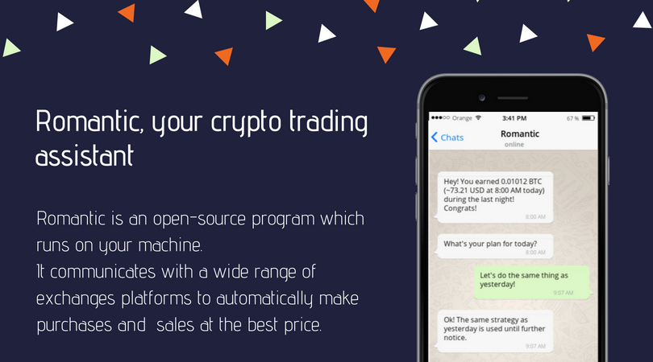

# Romantic Project




The Project
-----------

# This project is currently in development, do not use it in a production environment !

Romantic is a cryptocurrency trading assistant to help you in your everyday life.

Romantic is connected to many exchanges platforms such as GDAX, Bitfinex **(WIP)**, Poloniex **(WIP)**, Whaleclub **(WIP)**... With a wide range of informations got on these platforms, Romantic can decided for you when you have to sell and to buy your coins, and it does it all on its own for you!

Let's pick an example:

- It's 8 AM. Romantic just sent you a recap of the night: how many coins you earned, the volume of the night and the average earnings over the last 30 days.
- 9 AM - You eat your breakfast and in 5 minutes, you send a message to Romantic where you define your strategy of the day : would you like to choose to play safe and keep a maximum of your coins or do a maximum of actions?
- 12:15 PM - Romantic sends you a message: something happened. The Dogecoin lost 80% of its value. Your assistant asks you if you really want to hold this currency or if you prefer to invest in another one. You choose to invest 52$ in Ethereum.
- At 6 PM, Romantic sends you a good news. The Ethereum has increased in value: this compensated for the losses related to the decline of the Dogecoin.
- At 10:45 PM, it is the end of your day and you decide to turn off your phone. Just before that, you send a message to Romantic: "I'm going to sleep, take care". It replies: "No worries, your money is in good hands. I will be very careful during the night. Have a good night!". Romantic decides to perform the actions most likely to succeed.

This is just a simple scenario. The possibilities of Romantic are endless. You can choose which currency with which you wish to interact, which indicators to follow, which strategy to adopt ...

Are you new to finance and / or cryptocurrency? Don't worry, Romantic adapts its way of speaking and proposes different profiles.


Specifications
--------------

Romantic is 100% written in Go.

- Open-Source: Romantic’s core and its modules are 100% open-source and available on GitHub. Everyone can read, edit and modify the source and share it, or not, with the community.
- Design: Whichever way if you choose to interact with Romantic whether that be with a chat (Telegram...) or the dedicated interface, a good product always starts with a good design.
- Community: Romantic also is a whole community of users, developers, whale, who contribute each day to make Romantic better.
- Performance: The performance of the product is an important aspect of the project.
- Privacy: With Romantic, all your data stays locally on your machine. Nothing leaves your local database, your life stays private :)
- Magic: Your assistant will add some magic in your life!

Roadmap
-------


| Status | Module | Goals | Description |
| :---: | :---: | :---: | :---: |
| ❌ | **Romantic** | 0 / X | Core of the project, will receive datas and make every orders for you  |
| 🚀 | **[Romantic Aggregator](#romantic-aggregator)** | 60% | Receive tickers from exchanges Websocket |
| ❌ | **Romantic Hermes** | 0 / X | Hermes will draw the link between Romantic and each of the exchanges API to make every orders (buy/sell) |
| ❌ | **Romantic Front-end** | 0 / X | Whether it's done through a chat application or an interface, this will handle the commands made by the users |
| ❌ | **Romantic Warehouse** | 0 / X | Will manage the database |

Romantic Aggregator
===================

The purpose of the aggregator is to retrieve data (ticker) about the currencies to which the bot has registered. Once recovered, the data is sent to a Kafka stream. The bot will retrieve this data through the flow in order to choose the orders to perform.


Romantic adopts an architecture of Docker containers.

Roadmap of Romantic Aggregator
------------------------------

| Status | Goal | Description |
| :---: | :---: | :---: |
| 8% | **Exchanges** | Manages the APIs of exchange platforms (Send subscription and unsubscribe messages and receive datas). The status depends on the number of platforms to add. |
| ✔ | **Kafka** | Sends messages to the Kafka stream |
| ✔ | **API** | Receives orders from the Romantic Core or other HTTP requests (subscriptions/unsubscribe) |
| ✔ | **Aggregator** | Receives tickers from websocket clients of each exchanges and aggregates before sending them to Kafka |
| 🚀 | **Test** | [Actual coverage](#current-test-coverage) |

List of exchanges

| Status | Name |
| :---: | :---: |
|✔|[Bitfinex](https://www.bitfinex.com/)|
|✔|[GDAX](https://www.gdax.com/)|
|❌|[Alphapoint](https://www.alphapoint.com/)|
|❌|[ANX](https://anxpro.com/)|
|❌|[Binance](https://www.binance.com/)|
|❌|[Bitflyer](https://bitflyer.com/en-jp/)|
|❌|[Bithumb](https://www.bithumb.com/)|
|❌|[Bitstamp](https://www.bitstamp.net/)|
|❌|[Bittrex](https://bittrex.com/)|
|❌|[BTC Markets](https://www.btcmarkets.net/)|
|❌|[Coinut](https://coinut.com/)|
|❌|[Exmo](https://exmo.com/)|
|❌|[Gemini](https://gemini.com/)|
|❌|[HitBTC](https://hitbtc.com/)|
|❌|[Huobi](https://www.huobi.pro/)|
|❌|[Itbit](https://www.itbit.com/)|
|❌|[Kraken](https://www.kraken.com/)|
|❌|[LakeBTC](https://www.lakebtc.com/)|
|❌|[Liqui](https://liqui.io/)|
|❌|[LocalBitcoins](https://localbitcoins.com/)|
|❌|[OkCoin](https://www.okcoin.com/)|
|❌|[Okex](https://www.okex.com/)|
|❌|[Orderbook](https://www.orderbook.io/)|
|❌|[Poloniex](https://poloniex.com/)|
|❌|[WEX](https://wex.nz/)|
|❌|[Yobit](https://yobit.net/)|

### Current test coverage
**WIP**

## How can I use it ?

### With Docker:

First, you need to install [Docker](https://www.docker.com/) and [Docker-compose](https://docs.docker.com/compose/).

Then, when you're in the folder, use the terminal to perform these commands:

1. Build the docker image:
```bash
❯ make docker-build
```

3. Open another terminal (or another tab) and type:
```bash
❯ make kafka
```

2. Go back in your first terminal and run:
```bash
❯ make docker-run
```

### Without Docker:

1. Start Kafka:
```bash
❯ make kafka
```

2. Open another terminal (or another tab) and type:
```bash
❯ make run
```

### API routes

- Subscribe to a new channel
```bash
/ticker/{base}/{target}/subscribe
```

- Unsubscribe from a channel
```bash
/ticker/{base}/{target}/unsubscribe
```

Where `base` and `target` are a currency with a 3-letters format: BTC, USD, EUR, LTC, ETH...

- Modify the timer duration
```bash
/timer/{newDuration}
```

Where `newDuration` can be : 1m,3m,5m,15m,30m,45m,1H,2H,3H,4H,1D,1W,1M

## What is a subscription ? How can I manage it ?

A subscription is a message which is sent to the exchanges websocket to determine on which currency you want to get informations from. For example, if I want to get informations about Bitcoin, I will send a coded message like "I want to subscribe to the BTC-USD ticker". A Ticker channel returns informations like the current price, the volume in the last 24 hours, the lowest price and the highest price on the last 24 hours...

You can manage this by sending queries to the romantic-aggregator API **(WIP)**.


Contributing
============

Pull requests are welcome, but code must be efficient, readable and maintainable by all. Adds units tests. We cannot accept any PR if there is no test.

Community
=========

Romantic is not just a project, it's a community of people.

Meet some whales and fishs here : _Insert Discord/Slack link_
